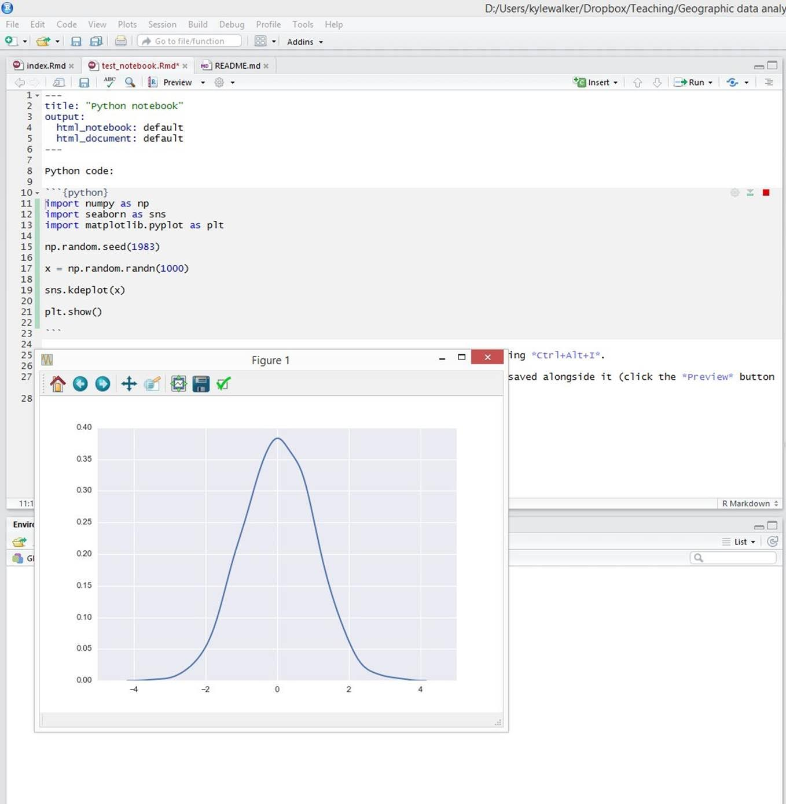

from "Python notebook.jpg"



Install modules:

    python3 -m pip install --user numpy scipy matplotlib ipython jupyter pandas sympy nose
    python3 -m pip install --user seaborn

Python code:

```{python, engine.path="/usr/local/bin/python3"}
import numpy as np
import seaborn as sns
import matplotlib.pyplot as plt

np.random.seed(1983)

x = np.random.randn(1000)

sns.kdeplot(x)

#plt.show()
plt.savefig('test_notebook.png')
```


